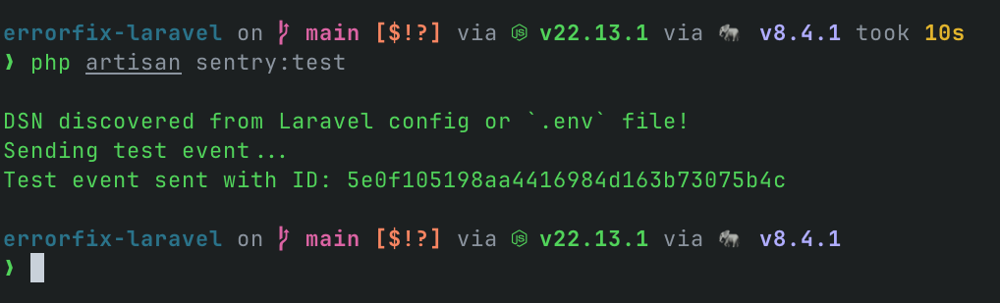
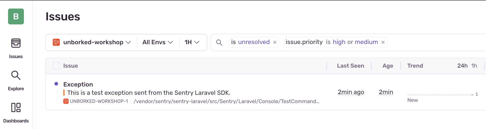

import { Steps } from '@astrojs/starlight/components';

Let's face it—your code is going to break. It happens to all of us. The question is: how fast can you fix it when it does? In this section, we'll add Sentry to our React and Laravel application so we can catch those errors in the wild before our users start tweeting about them.

## Setting Up Sentry

<Steps>

  1. **Create your Sentry Project**

     - Go to [Sentry.io](https://sentry.io) and create a new project
     - Select "Laravel" as the platform
     - Choose "Error Monitoring", "Tracing", and "Profiling"

     

     Take note of your DSN! You'll need it soon!

  2. **Add Sentry with Composer**

     ```bash
     composer require sentry/sentry-laravel
     ```

  3. **Update your `bootstrap/app.php` file**

     Replace the contents of your `bootstrap/app.php` file with the following:

     ```php
     <?php

     use App\Http\Middleware\HandleAppearance;
     use App\Http\Middleware\HandleInertiaRequests;
     use Illuminate\Foundation\Application;
     use Illuminate\Foundation\Configuration\Exceptions;
     use Illuminate\Foundation\Configuration\Middleware;
     use Illuminate\Http\Middleware\AddLinkHeadersForPreloadedAssets;
     use Sentry\Laravel\Integration;

     return Application::configure(basePath: dirname(__DIR__))
        ->withRouting(
            web: __DIR__.'/../routes/web.php',
            commands: __DIR__.'/../routes/console.php',
            health: '/up',
        )
        ->withMiddleware(function (Middleware $middleware) {
            $middleware->encryptCookies(except: ['appearance', 'sidebar_state']);

            $middleware->web(append: [
                HandleAppearance::class,
                HandleInertiaRequests::class,
                AddLinkHeadersForPreloadedAssets::class,
            ]);
        })
        ->withExceptions(function (Exceptions $exceptions) {
            Integration::handles($exceptions);
        })
        ->create();
     ```

      These changes will:
      - Add Sentry's integration to your Laravel application
      - Add the Sentry integration to the withException block

  3. **Configure the Sentry DSN from your project**

     Run the following command to create your `config/sentry.php` file and add your DSN and sample rates to the `.env` file. 

     ```bash
     php artisan sentry:publish --dsn=your-dsn-here
     ```

     Allow it to enable performing monitoring, and do not send the test event and transaction.

     Navigate to the `.env` file and confirm its configured correctly.


  4. **Verify your configuraiton**

     Use the following command to verify your configuration 

     ```bash
     php artisan sentry:test
     ```

     

   5. **Check Sentry for the test event**

      Verify in Sentry that the event was received.

      


     
</Steps>

## Understanding Sentry Features

<details>
<summary>Learn More: Error Monitoring</summary>

Error monitoring is the core functionality of Sentry. It allows you to:

- Capture unhandled exceptions in real-time
- See detailed stack traces
- Get context about the user and environment
- Track error frequency and impact
- Assign errors to team members for resolution

When an error occurs, Sentry will show you:
- The exact line of code that failed
- What function was being executed
- The sequence of function calls leading to the error
- What browser/device the user was using
- Custom context you've added to your app

This is essential for quickly identifying and fixing critical issues before they affect more users.
</details>

<details>
<summary>Learn More: Performance Monitoring</summary>

Performance monitoring helps you track how your application performs for real users:

- Track page load times
- Monitor API call durations
- Identify slow database queries
- See frontend rendering performance
- Set performance thresholds and alerts

Sentry's performance monitoring creates "transactions" for each significant operation in your app. Each transaction contains "spans" representing smaller operations within it.

This allows you to:
- See which parts of your application are running slowly
- Track performance over time
- Compare performance across different pages and features
- Identify performance regressions after deployments
- Correlate performance issues with errors

By monitoring performance, you can ensure your application not only works but works efficiently.
</details>

<details>
<summary>Learn More: Replays</summary>

Replays are like having a video recording of what your users experienced:

- Watch recreations of user sessions leading up to errors
- See exactly what users saw and did
- Identify UI/UX issues that lead to confusion
- Understand complex user interactions that trigger bugs
- Reproduce hard-to-track errors

Replays captures:
- DOM changes
- User interactions (clicks, scrolls, form inputs)
- Console logs
- Network requests

Privacy features ensure sensitive data isn't captured:
- Automatic PII masking
- Customizable privacy rules
- Consent-based recording

This feature dramatically reduces time spent trying to reproduce issues, especially those that depend on specific user interactions or state sequences.
</details>

## Next Steps

Now that Sentry is configured in your application, you're ready to start the workshop exercises. These will guide you through common scenarios and show you how to use Sentry to diagnose and fix them.

Head to the [Debugging Issues](/debugging-issues/) section to start your debugging journey.